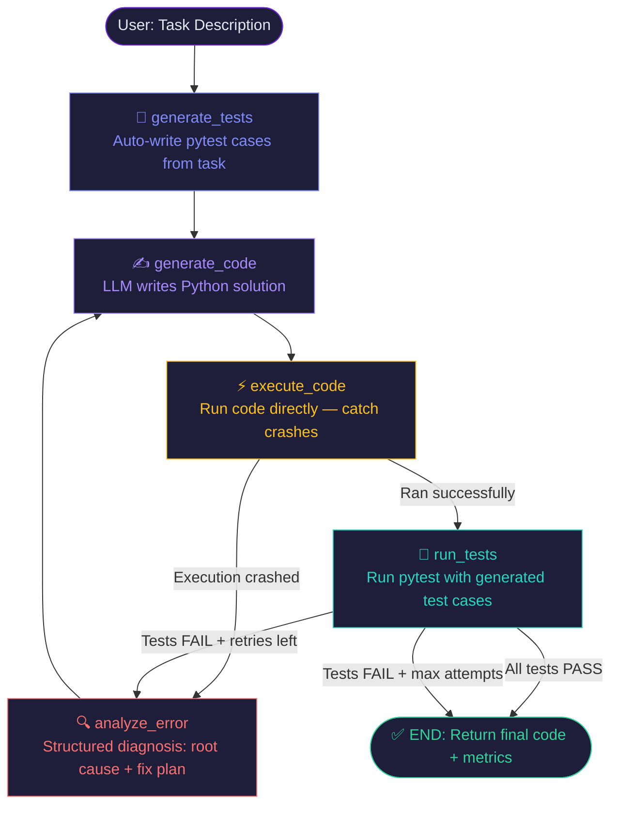
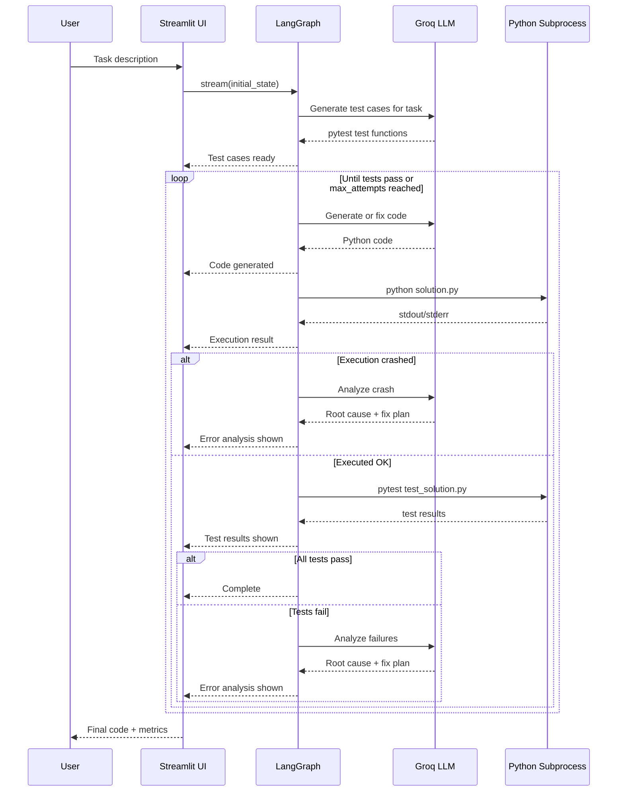

# Self-Correcting-Code-Assistant

Give it any task in plain English. It writes the code, generates its own test cases, executes and validates everything, and self-corrects until all tests pass — no manual testing required.

[](https://python.org)
[](https://streamlit.io)
[](https://langchain-ai.github.io/langgraph/)
[](https://groq.com)

---

## What It Does

Traditional AI code generation: LLM writes code → you test it → you debug it → repeat manually.

**CodeFix AI**: LLM writes code → agent tests it → agent debugs it → agent rewrites → repeats automatically.

```
You type:   "Write a function that finds all duplicates in a list"
Agent does: generates tests → writes code → runs tests → fixes errors → passes ✓
You get:    working, tested Python code
```

---

## Pipeline Architecture



---

## Self-Correction Loop



---

## System Overview

```
┌───────────────────────────────────────────────────────┐
│                    USER (Browser)                     │
│         Task input · Live output · Final code         │
└───────────────────────────┬───────────────────────────┘
                            │ HTTP
                            ▼
┌───────────────────────────────────────────────────────┐
│              STREAMLIT (app.py)                       │
│  session_state persistence · live render_all()        │
└───────────────────────────┬───────────────────────────┘
                            │ Python call
                            ▼
┌───────────────────────────────────────────────────────┐
│           LANGGRAPH STATEGRAPH (graph/pipeline.py)    │
│                                                       │
│  generate_tests → generate_code → execute_code        │
│                        ▲              │               │
│                        │         crash│ok             │
│                  analyze_error   ←────┘               │
│                        ▲         run_tests            │
│                        └──────── fail│pass            │
│                                      ▼                │
│                                     END               │
└──────────────┬────────────────────────────────────────┘
               │ API calls (3 nodes)
               ▼
┌───────────────────────────────────────────────────────┐
│              GROQ API — Llama-3.3-70B                 │
│    test_generator · code_generator · error_analyzer   │
└───────────────────────────────────────────────────────┘
               │ subprocess
               ▼
┌───────────────────────────────────────────────────────┐
│         LOCAL PYTHON SUBPROCESS (isolated)            │
│      execute_code · run_tests · tempfile sandbox      │
└───────────────────────────────────────────────────────┘
```

---

## Folder Structure

```
codefix-ai/
│
├── agents/
│   ├── state.py              ← AgentState TypedDict — shared schema
│   ├── test_generator.py     ← Node ①: auto-generates pytest cases from task
│   ├── code_generator.py     ← Node ②: writes/rewrites code (3 prompt strategies)
│   ├── code_executor.py      ← Node ③: direct python run — catches crashes early
│   ├── test_runner.py        ← Node ④: pytest in isolated subprocess
│   ├── error_analyzer.py     ← Node ⑤: structured root cause diagnosis
│   └── __init__.py
│
├── graph/
│   ├── pipeline.py           ← LangGraph StateGraph + conditional retry edges
│   └── __init__.py
│
├── .streamlit/
│   └── config.toml           ← Dark violet theme
│
├── app.py                    ← Streamlit UI (entry point)
├── .env.example
├── requirements.txt
└── README.md
```

---

## Agent Details

| Agent | Input | Output | Uses LLM? |
|---|---|---|---|
| `test_generator` | `task` | `generated_tests` | ✅ |
| `code_generator` | `task` + `error_analysis` | `code` | ✅ |
| `code_executor` | `code` | `execution_status`, `execution_output` | ❌ |
| `test_runner` | `code` + `generated_tests` | `test_output`, `status` | ❌ |
| `error_analyzer` | `code` + `error_log` | `error_analysis` | ✅ |

3 LLM calls per retry cycle. Code execution and testing run locally — no API cost.

---

## Setup

```bash
git clone https://github.com/kunwardhruv/codefix-ai
cd codefix-ai

pip install -r requirements.txt

# Get free API key at console.groq.com
copy .env.example .env
# Add: GROQ_API_KEY=gsk_...

streamlit run app.py
```

---

## Test Cases

### Easy — first attempt pass

**Palindrome Check**
```
Write a function is_palindrome(s) that returns True if the string is a palindrome.
Ignore spaces, punctuation, and case.
"A man a plan a canal Panama" → True
```

**FizzBuzz**
```
Write a function fizzbuzz(n) that returns a list of strings 1 to n.
Multiples of 3 → "Fizz", 5 → "Buzz", both → "FizzBuzz", else number as string.
```

### Medium — 1-2 retries

**Anagram Groups**
```
Write a function group_anagrams(words) that groups anagrams together.
["eat","tea","tan","ate","nat","bat"] → [["eat","tea","ate"],["tan","nat"],["bat"]]
```

**Longest Substring Without Repeating**
```
Write a function longest_unique_substring(s) that returns the length of the longest
substring without repeating characters. "abcabcbb" → 3
```

**Flatten Nested List**
```
Write a function flatten(lst) that flattens any depth of nested lists.
[1, [2, [3, [4]], 5]] → [1, 2, 3, 4, 5]
```

**LRU Cache**
```
Write a class LRUCache(capacity) with get(key) and put(key, value) methods.
Evict least recently used when over capacity. Standard library only.
```

### Hard — multiple retries

**Valid Sudoku**
```
Write a function is_valid_sudoku(board) that takes a 9x9 grid (list of lists, "." for empty)
and returns True if no row, column, or 3x3 box has duplicate digits.
```

**Word Ladder**
```
Write a function word_ladder(begin_word, end_word, word_list) that returns the minimum
number of single-letter transformations to reach end_word. Return 0 if impossible.
```

### Edge case stress tests

**Roman Numeral Round Trip**
```
Write int_to_roman(num) and roman_to_int(s).
Must be perfect inverses: roman_to_int(int_to_roman(n)) == n for all n in 1-3999.
```

**Expression Evaluator (no eval)**
```
Write evaluate(expression) for math strings with +, -, *, / and parentheses.
No eval() allowed. "(1+2)*(3+4)" → 21. Handle operator precedence.
```

---

## Key Design Decisions

**Why generate tests before code?**
Test-first forces the LLM to reason about *what* the code must do before *how* — higher first-attempt pass rate.

**Why subprocess instead of exec()?**
`exec()` runs untrusted LLM code in-process. A bad generation can crash the entire agent. Subprocess gives full isolation + 15s timeout.

**Why a dedicated error_analyzer node?**
Raw traceback → code_generator = blind retry. Structured diagnosis (root cause + specific lines + fix plan) → targeted rewrite = fewer retries.

**Why temperature=0?**
Code needs determinism. Randomness hurts correctness here.

**Why session_state for results?**
Streamlit re-runs the whole script on every click. Without session_state, clicking any expander clears all output.

---

## Author

**Vedant Mohadikar** 

- LinkedIn: www.linkedin.com/in/vedant-mohadikar-4029a8252
- GitHub: [github.com/VedantMohadikar](https://github.com/VedantMohadikar)
- Email: mvedant1607@gmail.com
